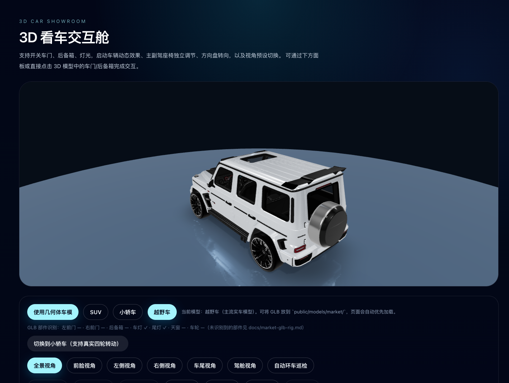
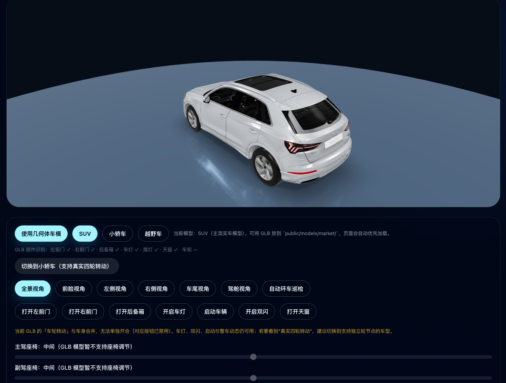

# 3D Car Viewing · 3D 看车

[](https://github.com/jiaxiantao/3d-car-viewing/actions/workflows/ci.yml)
[](LICENSE)
[](https://jiaxiantao.github.io/3d-car-viewing/)

**English:** Browser-based 3D car showroom built with **Next.js**, **React Three Fiber**, and **Three.js**. Switch GLB vehicles, interact with doors / lights / paint, swap studio / day / night scene modes, save screenshots, and fall back to a procedural car when assets fail to load.

**中文：** 在浏览器中体验 3D 看车：车型切换、部件 / 灯光 / 启停 / 制动交互、影棚 / 白天 / 夜晚场景、一键截图与全屏。支持主流 GLB 车模，并具备几何体回退。

## 在线预览

在浏览器中直接体验完整交互（无需本地安装）：

**[https://jiaxiantao.github.io/3d-car-viewing/](https://jiaxiantao.github.io/3d-car-viewing/)**

> 由 GitHub Actions 将 Next.js 静态导出部署至 GitHub Pages。首次打开若 GLB 较大，加载可能需要数秒；加载失败会自动回退几何体车模。

## 效果预览

<p align="center">
  
</p>

<p align="center">
  
</p>

<p align="center">
  
</p>

## 功能特性

- **车型切换**：SUV / 小轿车 / 越野车（`public/models/market/*.glb`）
- **部件交互**：车门、后备箱、天窗、车灯、双闪、启动、制动（依 GLB 网格命名自动识别）
- **物理拟真**：怠速发动机微抖、加速 / 制动俯仰、车轮旋转、制动时尾灯刹车灯亮起、双闪频闪
- **场景模式**：影棚 / 白天 / 夜晚，一键切换灯光、地面材质与雾效，夜晚自带湿地反射
- **视觉**：车漆配色、多机位预设、自动环车巡检、本地 IBL 光照（无外部 HDR CDN 依赖）
- **看车工具**：截图保存当前画面、一键全屏看车、键盘快捷键
- **可分享深链**：车型 / 车漆 / 视角 / 场景模式持久化在 URL，使用 `replaceState` 不污染历史栈；工具栏一键复制分享链接（`C`）
- **性能**：`AdaptiveDpr` / `AdaptiveEvents`、动态 Reflector 分辨率、`preserveDrawingBuffer` 截图友好
- **响应式**：移动端 60vh 画布、Tabs 折叠交互区、车型按钮自适应换行
- **健壮性**：GLB 加载失败时回退内置几何体车模；切换车型时保留上一模型直至新资源就绪

## 快速开始

### 环境要求

- [Node.js](https://nodejs.org/) 20+
- [pnpm](https://pnpm.io/) 9+

### 安装与开发

```bash
git clone https://github.com/jiaxiantao/3d-car-viewing.git
cd 3d-car-viewing
pnpm install
cp .env.example .env   # 可选，见下方环境变量
pnpm dev
```

浏览器打开 [http://localhost:3000](http://localhost:3000)。

> **仓库体积说明：** `public/models/market/` 内含约 **120MB** 的 GLB 资源，首次 clone 会较慢。若你只需改前端逻辑，可暂时删除 GLB，应用会自动使用几何体回退车模。

### 环境变量

| 变量 | 说明 | 默认 |
|------|------|------|
| `NEXT_PUBLIC_SITE_URL` | 站点 URL（元数据 / 部署） | `http://localhost:3000` |

复制 `.env.example` 为 `.env` 即可本地覆盖。

### 构建与生产

```bash
pnpm build          # Next.js standalone 输出
pnpm start          # node .next/standalone/server.js
pnpm lint           # ESLint
pnpm typecheck      # tsc --noEmit
```

### Docker

```bash
docker compose up --build
```

服务监听 `http://localhost:3000`。

### GitHub Pages 在线部署

在线地址：**https://jiaxiantao.github.io/3d-car-viewing/**

推送 `main` 后，[Deploy GitHub Pages](.github/workflows/deploy-pages.yml) 会构建静态站点并发布到 **`gh-pages` 分支**（不会把约 120MB 的 GLB 写进 `docs/`）。

**首次使用请在 GitHub 改一次 Pages 配置（否则会 404）：**

1. 打开 **Settings → Pages → Build and deployment**
2. **Source** → **Deploy from a branch**
3. **Branch** 选 **`gh-pages`**，文件夹选 **`/ (root)`**（不要选 `main` + `/docs`）
4. 保存后等待 Actions 部署完成

`docs/` 目录仅存放 Markdown 文档；详细说明见 [docs/GITHUB_PAGES_SETUP.md](docs/GITHUB_PAGES_SETUP.md)。

推送 `main` 时仅运行 **Deploy GitHub Pages**（含 lint / typecheck / 构建 / 发布）；**CI** 仅在 Pull Request 时运行。

本地验证：

```bash
pnpm build:pages   # 输出到 out/，basePath 为 /3d-car-viewing
```

## 项目结构

```
├── src/
│   ├── app/                    # Next.js App Router（page、layout、SEO 元数据）
│   ├── components/
│   │   ├── car-showroom-scene.tsx     # R3F 展厅主场景
│   │   ├── showroom-environment.tsx   # 地面、灯光、本地 IBL
│   │   └── showroom-quick-actions.tsx # 场景模式 / 截图 / 全屏工具栏
│   └── lib/
│       ├── asset-car-rig.ts           # GLB 部件自动发现
│       ├── market-rig-profiles.ts     # 按车型 URL 的识别规则
│       ├── showroom-camera.ts         # 相机与轨道限制
│       ├── showroom-scene-modes.ts    # 影棚 / 白天 / 夜晚配置
│       ├── showroom-paint-options.ts  # 车漆调色板
│       ├── car-categories.ts          # 内置车型与 GLB 路径
│       ├── use-showroom-url-state.ts  # URL ↔ 状态双向同步、分享链接
│       ├── gltf-scene-cache.ts        # GLB 缓存与空闲预加载
│       └── use-showroom-shortcuts.ts  # 键盘快捷键
├── public/models/market/       # GLB 车模（见 ATTRIBUTION）
├── docs/
│   ├── market-glb-rig.md       # 交互映射与建模要求
│   ├── ARCHITECTURE.md         # 架构说明
│   └── ATTRIBUTION.md          # 第三方资源与许可
└── .github/workflows/ci.yml    # lint + typecheck + build
```

更细的模块关系见 [docs/ARCHITECTURE.md](docs/ARCHITECTURE.md)。技术实践博客见 [docs/3D看车技术博客.md](docs/3D看车技术博客.md)。

## 车型资源

将 GLB 放到 `public/models/market/`（文件名需与 `src/app/page.tsx` 中配置一致）：

| 文件 | 用途 |
|------|------|
| `suv-mainstream.glb` | SUV |
| `sedan-mainstream.glb` | 小轿车 |
| `offroad-mainstream.glb` | 越野车 |

- 加载失败 → 自动使用内置几何体 `CarModel`
- 自定义车型 → 阅读 [docs/market-glb-rig.md](docs/market-glb-rig.md)，在 `market-rig-profiles.ts` 增加 `MarketRigProfile`

**许可与商标：** 仓库内示例 GLB 来自第三方作者，**本仓库 MIT 许可证仅覆盖源代码**，不包含车模知识产权。商用或再分发前请阅读 [docs/ATTRIBUTION.md](docs/ATTRIBUTION.md) 并自行确认授权。

## 技术栈

| 类别 | 技术 |
|------|------|
| 框架 | Next.js 16 · React 19 |
| 3D | three · @react-three/fiber · @react-three/drei |
| 样式 | Tailwind CSS 4 · TypeScript 5 |

## 键盘快捷键

> 在表单输入态（input / textarea / contentEditable）下自动失效；不响应带 Cmd / Ctrl / Alt 修饰键的组合。

| 键位 | 作用 |
|------|------|
| `1`–`6` | 全景 / 前脸 / 左侧 / 右侧 / 车尾 / 驾舱视角 |
| `T` | 自动环车巡检开关 |
| `E` | 启动 / 熄火 |
| `L` | 车灯开关 |
| `H` | 双闪开关 |
| `A` / `D` | 右前门 / 左前门 |
| `B` | 后备箱开关 |
| `S` | 保存当前画面为图片 |
| `C` | 复制分享链接 |
| `F` | 全屏 / 退出全屏 |

## 参与贡献

欢迎 Issue 与 Pull Request。请先阅读 [CONTRIBUTING.md](CONTRIBUTING.md) 与 [CODE_OF_CONDUCT.md](CODE_OF_CONDUCT.md)。

安全相关问题请见 [SECURITY.md](SECURITY.md)，勿在公开 Issue 中披露漏洞细节。

## 更新日志

见 [CHANGELOG.md](CHANGELOG.md)。

## 许可证

本项目**源代码**采用 [MIT License](LICENSE)。

Bundled 3D models in `public/models/market/` are subject to their respective authors' licenses — see [docs/ATTRIBUTION.md](docs/ATTRIBUTION.md).
