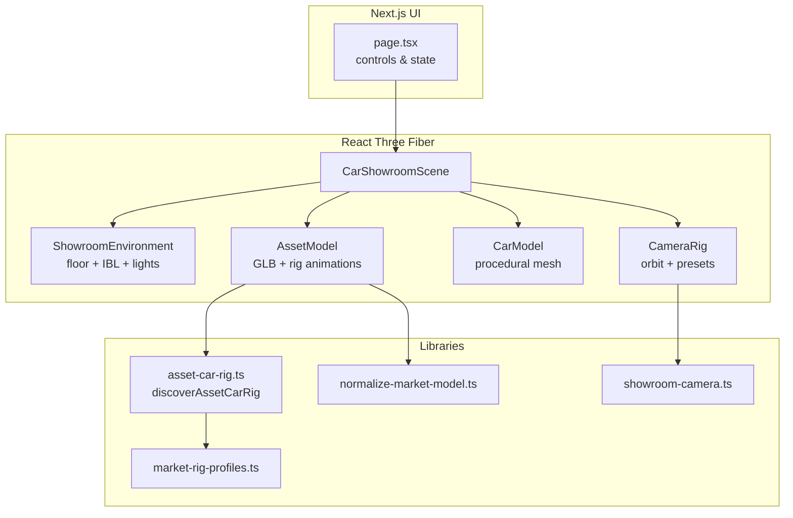

# Architecture

This document describes how the 3D showroom is structured for contributors.

## High-level flow

## State ownership

| Layer | Responsibility |
|-------|----------------|
| `page.tsx` | User-facing toggles (doors, lights, paint, category), passes props into the canvas |
| `car-showroom-scene.tsx` | WebGL lifecycle: GLTF loading, overlay, camera transitions, applying rig to meshes |
| `asset-car-rig.ts` | One-time scan of loaded `THREE.Object3D` tree → `AssetCarRig` handles |
| `market-rig-profiles.ts` | Per-URL regex overrides when auto-discovery is ambiguous |

Interaction buttons on the page are **disabled until** `onAssetRigCapabilities` reports which features the current GLB supports.

## GLB load pipeline

1. `page.tsx` selects `modelUrl` from category (`useMemo`, no effect sync).
2. `AssetModel` tries `modelUrl`, then optional alternates / fallback URL.
3. On success: `normalizeMarketModel()` scales/grounds the root; `discoverAssetCarRig()` builds rig + capability flags.
4. On failure: `useGeometricFallback` → render `CarModel` instead.
5. While loading: previous GLB may stay visible under a fullscreen `Html` loader (drei).

## Camera

`showroom-camera.ts` computes framing from an axis-aligned bounding box of the active car root. Orbit min/max distance and preset positions (overview, front, interior, etc.) derive from that box so different vehicle scales share one code path.

## Environment

`showroom-environment.tsx` uses Three.js `RoomEnvironment` + PMREM for reflections. No `@react-three/drei` `<Environment preset="…" />` CDN fetch — suitable for offline / air-gapped deploys.

## Extension points

- **New vehicle:** add GLB under `public/models/market/`, wire URL in `page.tsx`, add `MarketRigProfile` if needed.
- **New interaction:** extend `AssetCarRig` discovery in `asset-car-rig.ts` and wire animation in `AssetModel` inside `car-showroom-scene.tsx`.
- **Performance:** shadow map size, `dpr` cap, and reflector resolution are centralized in `car-showroom-scene.tsx` Canvas props.

See also [market-glb-rig.md](./market-glb-rig.md) for mesh naming requirements.
