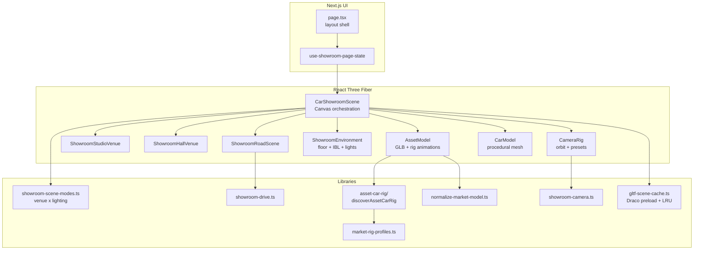

# Architecture

This document describes how the 3D showroom is structured for contributors.

## High-level flow

## State ownership

| Layer | Responsibility |
|-------|----------------|
| `use-showroom-page-state.ts` | User-facing toggles, URL hydrate, welcome / drive presets, capability gating |
| `page.tsx` | Layout shell: canvas, viewport chrome, control panels |
| `car-showroom-scene.tsx` | WebGL lifecycle: GLTF loading, venue swap, camera, screenshot bridge |
| `showroom/loading-overlay.tsx` | DOM progress overlay painted outside the WebGL canvas |
| `showroom/asset-car-model.tsx` / `procedural-car-model.tsx` | Per-frame mesh animation |
| `asset-car-rig/` | One-time scan of a loaded `THREE.Object3D` tree → `AssetCarRig` handles |
| `market-rig-profiles.ts` | Per-URL regex overrides when auto-discovery is ambiguous |

Interaction buttons on the page are **disabled until** `onAssetRigCapabilities` reports which features the current GLB supports.

## GLB load pipeline

1. `use-showroom-page-state.ts` selects `modelUrl` from `car-categories.ts`.
2. `AssetModel` tries `modelUrl`, then optional alternates / fallback URL.
3. On success: `normalizeMarketModel()` scales/grounds the root; `discoverAssetCarRig()` builds rig + capability flags.
4. On failure: `useGeometricFallback` → render `CarModel` instead.
5. While loading: the previous GLB may stay visible under a DOM overlay outside the canvas (`ShowroomAssetLoadingOverlay`).
6. After the active model is ready, `scheduleIdleGltfPreloads()` warms other category URLs in `gltf-scene-cache.ts` when the browser is idle.

## Camera

`showroom-camera.ts` computes framing from an axis-aligned bounding box of the active car root. Orbit min/max distance and preset positions (overview, front, interior, etc.) derive from that box so different vehicle scales share one code path.

## Environment

Venue and lighting are independent. `showroom-scene-modes.ts` maps `studio` / `hall` / `road` × `day` / `night` to background, fog, and light intensities. `CarShowroomScene` swaps the backdrop:

| Venue | Component | Assets |
|-------|-----------|--------|
| `studio` | `showroom-studio-gallery.tsx` | `public/models/scene/white_round_exhibition_gallery.glb` |
| `hall` | `showroom-hall-scene.tsx` | `public/models/scene/car-showroom_1.glb` |
| `road` | `showroom-road-scene.tsx` | procedural asphalt plus `realtime_grass.glb` and `tree_animate.glb` |

The highway parks the car in the first right-hand lane. `showroom-drive.ts` slides that scenery when the drive preset rolls the wheels forward with the steering centered.

`showroom-environment.tsx` uses Three.js `RoomEnvironment` + PMREM for reflections. No `@react-three/drei` `<Environment preset="…" />` CDN fetch — suitable for offline / air-gapped deploys.

Share links store `mode` (venue) and `light` (day or night). Legacy `mode=day` and `mode=night` still resolve to the studio.

## Extension points

- **New vehicle:** add a GLB under `public/models/market/`, register it in `car-categories.ts`, and add a `MarketRigProfile` when auto-discovery is ambiguous.
- **New interaction:** extend discovery under `asset-car-rig/` and wire the animation in `showroom/asset-car-model.tsx`.
- **Performance:** shadow map size, `dpr` cap, and reflector resolution are centralized in `car-showroom-scene.tsx` Canvas props.

See also [market-glb-rig.md](./market-glb-rig.md) for mesh naming requirements.
